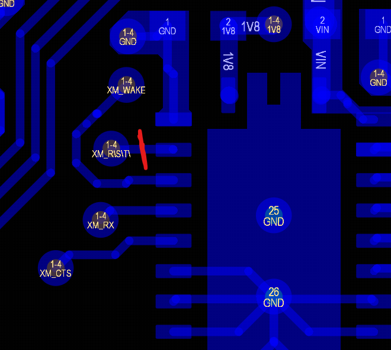
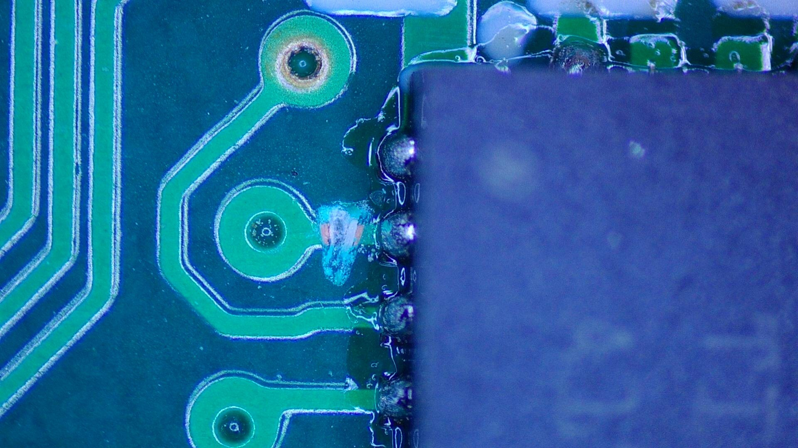
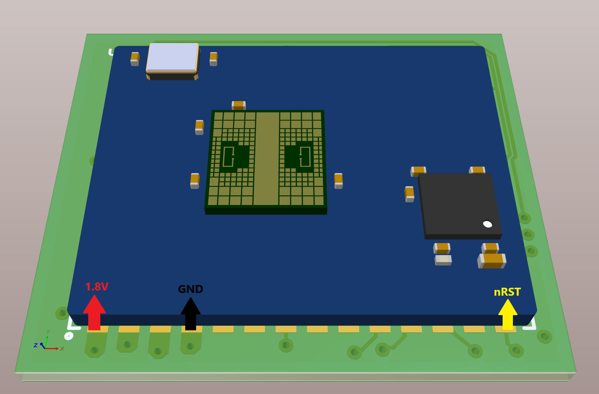
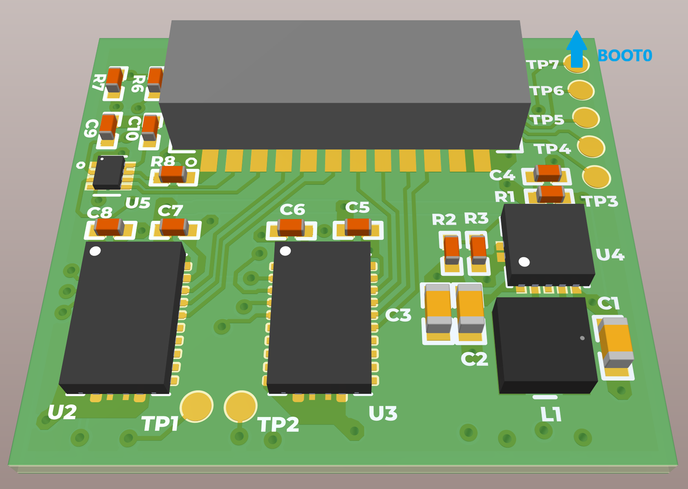

# Errata

This document outlines the design errors found during testing

## nRST line held low

The RESET line is active low and held low because it is connected to the SN74LVC8T245RHLR (which holds it low). This results in the device never "waking up", nor able to be programmed.

To release it, the RST line was cut from U3 (SN74LVC8T245RHLR)

## Flash firmware without buttons

Buttons on the reset and boot0 lines were unintentionally omitted, which makes uploading new firmware to the STM32 device inconvenient, although possible. Here are the steps

1. Ensure the nRST line is cut per above rework
2. Extend wires on the following nodes:
   1. 1.8V
   2. TP7 (BOOT0 pin)
   3. XM_nRST
   4. GND
3. GOAL: Tie BOOT0 to 1.8V, then "tap" nRST to GND, then release BOOT0. This allows the device to wake from reset with the boot pin held high, indicating it should enter bootloader mode.

