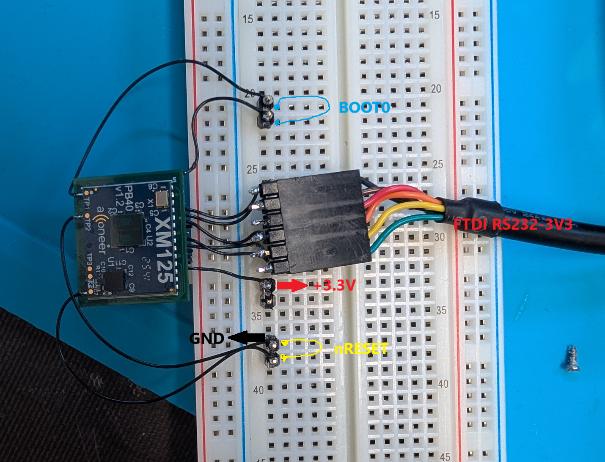
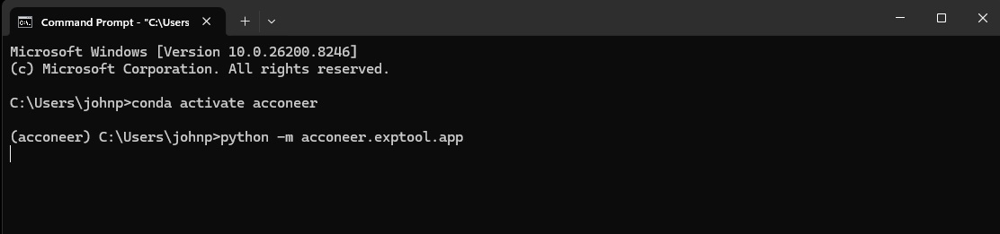
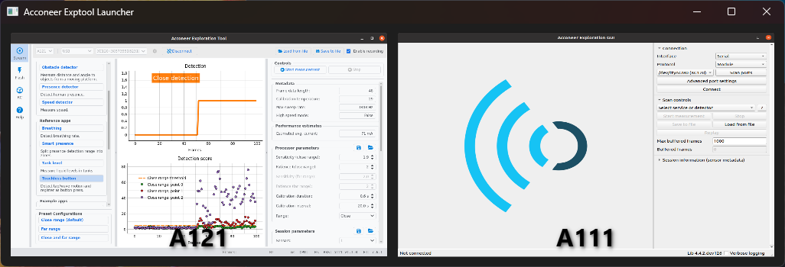
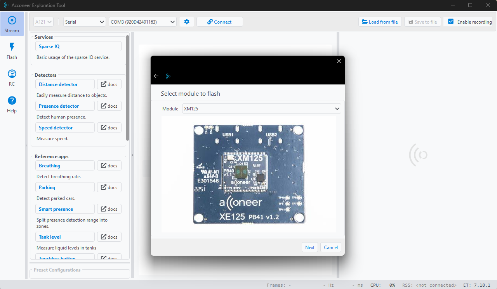
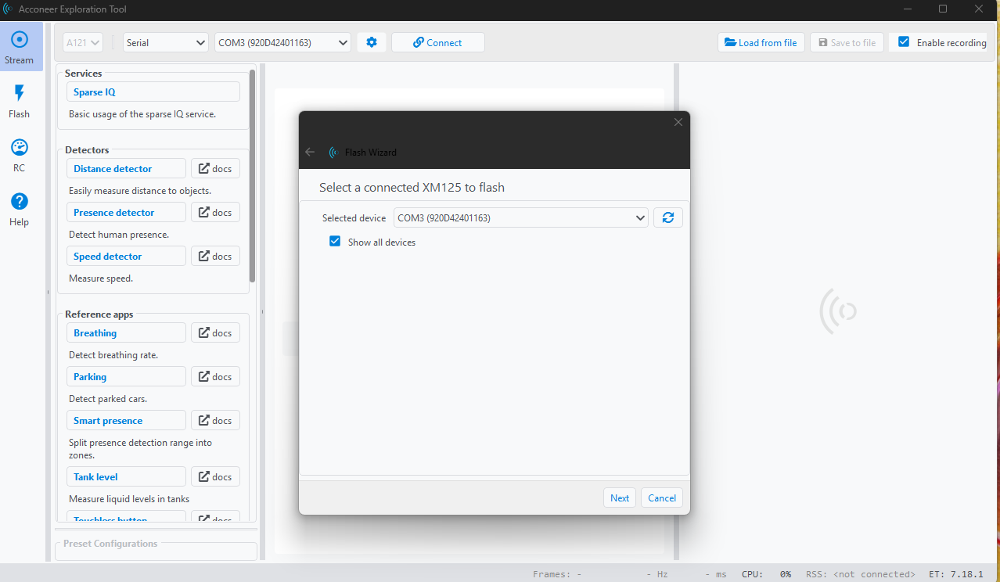
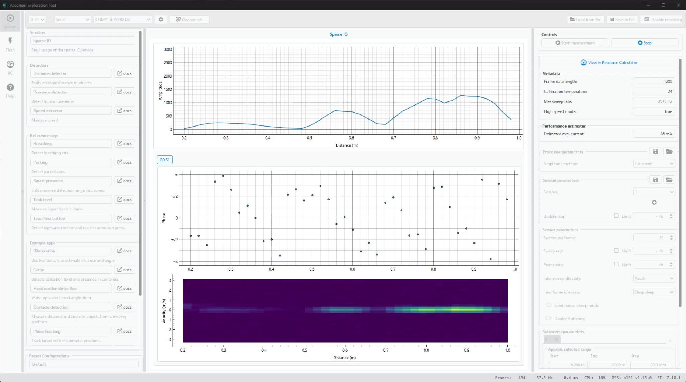
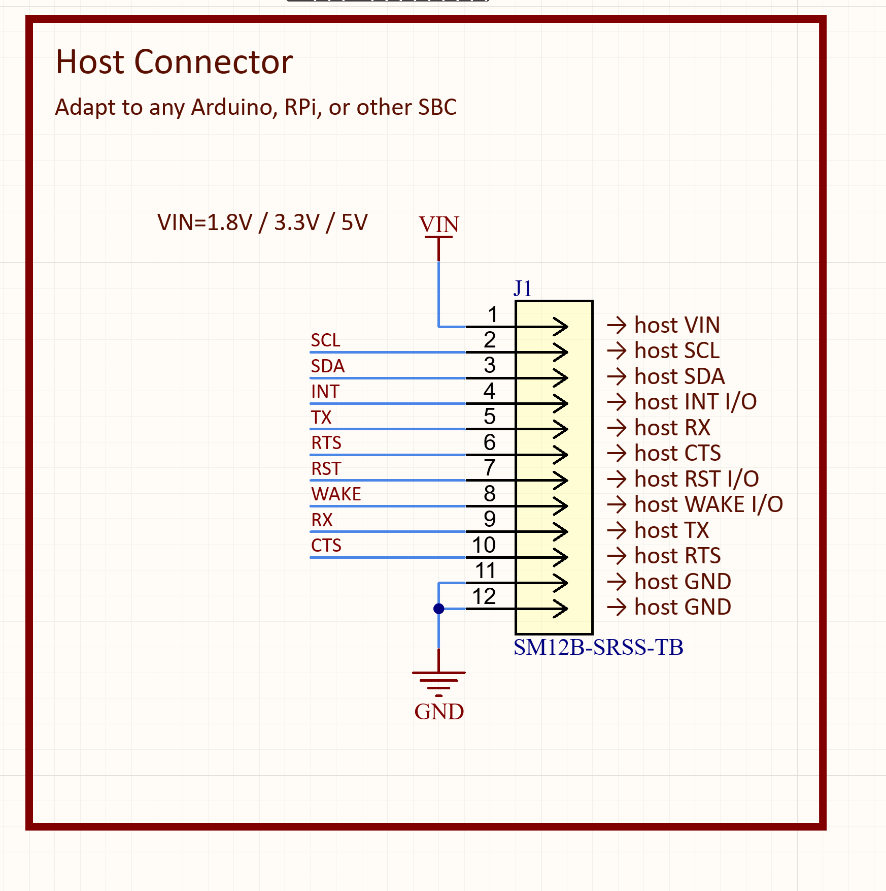

# Flash and Test

## Setup - Hookup For flashing

In order to flash firmware to the STM32 controller onboard the XM125, modifications outlined in the [ERRATA.md](ERRATA.md) are required first. This resuls in the following setup, exposing the BOOT0 pin, the nRST pin, and the VIN line (connected to 3.3V in this case). If VIN = 3.3V, then an FTDI TTL-232R-3V3 cable must be used. If a different VIN is used, the USB<>UART connection should have matching levels.

This setup assumes a 3.3V VIN for now.

After the rework and hookup is complete, connect the 3.3V source (red and black arrows), then connect the FTDI cable to a specially designed programmer cable connecting the UART TX, RX, RTS, CTS, and GND wires to the appropriate pinouts on the PCB.

## Setup - Flash and Test with Python Exploration Tool

These instructions use the [Acconeer Exploration Tool](https://github.com/acconeer/acconeer-python-exploration) code and instructions

1. Ensure you have a Python environment with >= Python 3.9 installed
2. Run `python -m pip install --upgrade acconeer-exptool[app]` to install the explorer tool
3. After installation, run `python -m acconeer.exptool.app` to launch the tool
4. Select the 'A121' block when the tool starts
5. Click the "Flash" icon and follow the on-screen instructions
6. Select the XM125 module to flash
7. Check "Show all devices" and then select the COM port associated with your FTDI cable
8. Follow the onscreen instructions to download and flash the device
9. Then select the "Stream" panel item, and click the "Sparse IQ" item under "Services". 
10. In the toolbar, select the same COM port associated with your FTDI cable and tap "Connect"
11. After connecting, tap "Start Measurement" in the right panel to test it

Below are screenshots demonstrating the above

## Host Connection

